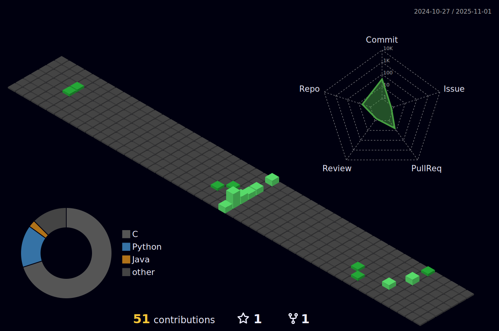

# 💫 About Me:
Sou o matheus e sou desenvolvedor de softwares 

## 🌐 Socials:
  
🔗 Perfil institucional: [github.com/mathde-s](https://github.com/mathde-s)

# 💻 Tech Stack:
       
# 📊 GitHub Stats:
 

<!-- Proudly created with GPRM ( https://gprm.itsvg.in ) -->
